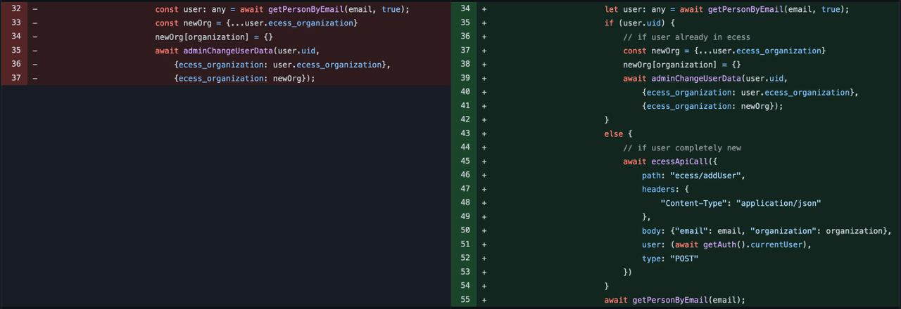
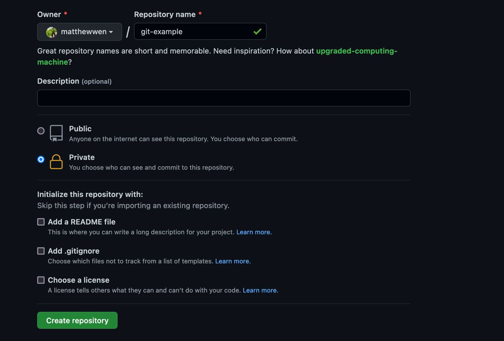
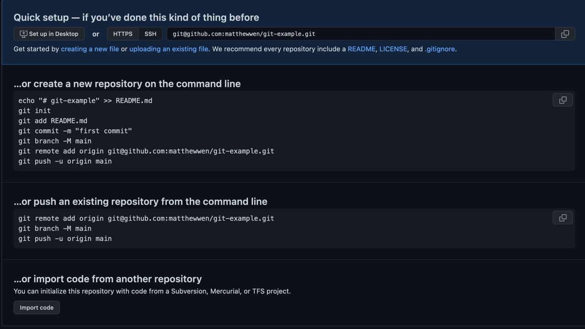
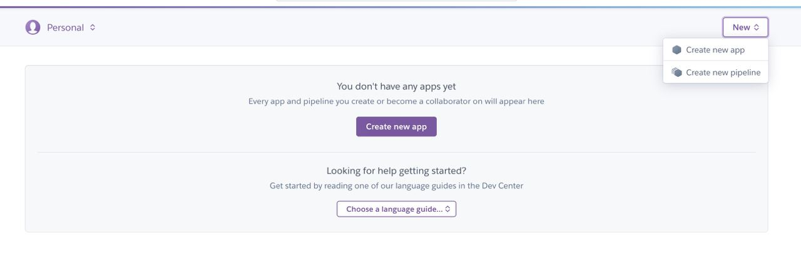
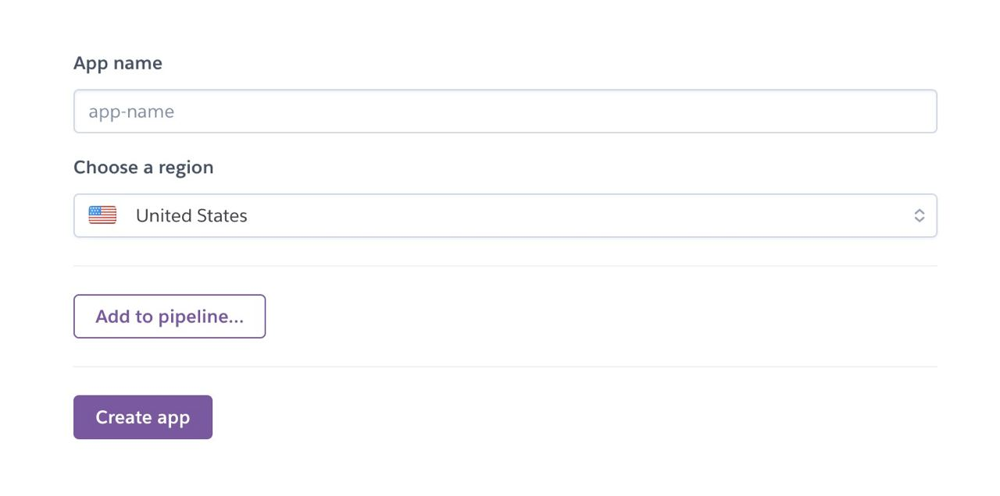
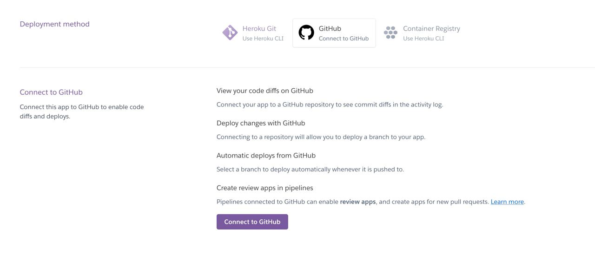
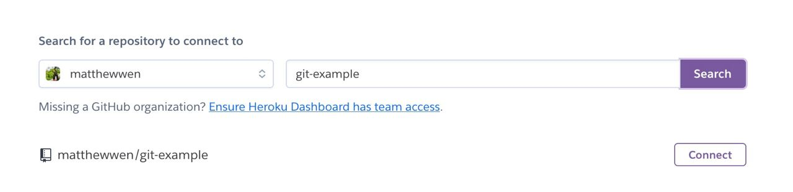

# GitHub, Template API, and Heroku

## GitHub
### What is git? 
According to the offical documentation from git itself, it is a 'stupid' file tracking system, but it is anything but stupid. git is a command line tool (cli) to help developers track their code. 


### Commands

##### Setting it up
```
$ git init
$ git add .
$ git commit -m "Initial Commit"
$ git branch -m main
```
```git init``` initalize the directory as a git repository 

```git add .``` add all files inside the directory into git.
If you want to do a single file, you can just do ```git add example.txt```, where example.txt is the file name you want to add.

```git commit -m "Inital Commit"``` tag your changes that you added from ```git add .```

```git branch -m main``` this renames the branch you are currently in into main.

##### The Usual Procedues with Git
The **main** branch is where most of your production code changes 
go. So let's say you want to add a new feature inside your
application, you will put that into one commit inside your
main branch because if that one feature has a major bug, then 
you would want to be able to undo that change ASAP.
But what if you want to add increments to your code where
you slowly build out that feature, but the changes are so incremental that it isn't worth having a ton of those inside
of main, that's where feature branches come in. Here is an example. 
```
$ git checkout -b feature-write-description
$ git add .
$ git commit -m "Added Minor Feature to that Next Big Feature 😉"
~ Type Code ~
$ git add .
$ git commit -m "Added Another Minor Feature to that Next Big Feature 😉"
```
But let's say you been writing in the wrong branch, and you want to be working inside a new branch. Then you can just do this instead of using the checkout command. 
```
$ git branch -m woops-wrong-branch-fixed-it
```

##### Favorite Commands
1. Wanna undo all your changes, that's what ```git reset --hard HEAD```. If you want to go back multiple commits, than you can do ```git reset --hard HEAD~x``` where x is the number of commits you want to go back.
2. Every just want to undo all changes into one file. Then you can do this command ```git checkout example.txt``` to get the file from previous commit. You can even 
3. Check the files ready for commit by typing ```git status```
4. Check what branch you are on by typing ```git branch```


### What does git have to do with GitHub?
GitHub is a service owned by Microsoft, where you can use 
GitHub UI to see your changes from git into a nice website.
So how do you connect GitHub to your application? It's complicated, so I'll leave this link: 
https://docs.github.com/en/authentication/connecting-to-github-with-ssh/generating-a-new-ssh-key-and-adding-it-to-the-ssh-agent

#### Connecting git with GitHub
Once you follow the tutorial, you should be able to do the following. 
```
$ git clone git@github.com:matthewwen/purdue.git
```
This command creates a new directory called purdue at whatever location this terminal is at. $(pwd)

But what if you are already inside a git repo, then what? Then you can add it with the following commands.
```
$ git remote add origin git@github.com:matthewwen/purdue.git
```
origin is the name of your remote (by default). You can rename it to something else like this. 
```
$ git remote add ece git@github.com:matthewwen/purdue.git
```
But let's say there is already a remote named origin, and I want to change it. Then I can do this. 
```
$ git remote set-url origin git@github.com:matthewwen/purdue.git
```

#### Adding your Changes to GitHub
You can run the following command to add your changes into Git.
```
git push origin main
```
It puts your changes in main into the remote origin. You should be able to see your changes inside of GitHub.

If you want to fetch your changes from GitHub (as if someone made a change to it, and you need to update your directory locally), then you can just run this command. 
```
$ git fetch origin (name of the remote)
```
And if you want to merge changes from remote, after calling fetch, you can run this command. 
```
$ git checkout origin/[remote branch name] --track
```

#### Combining Branches into One
There will be a time when you want to combine the work of two banches into one. You can do the following. 
```
$ git merge [branch name]
```
This merge the changes from [branch name] into your current branch. Same can be applied to changes from remote. 
```
$ git merge [remote reference]/[branch name] 
```
Here is an example
```
$ git merge origin/main
```

#### Let's Talk about that Template API
Let's practice Git with the Template API.
First download the Template API from GitHub. 
It should look like this. You can do these two things.

Option 1
```
$ git clone https://github.com/Purdue-ECESS/template-api
$ cd template-api
$ git remote remove origin
```
Option 2
(Download it by Clicking Download on GitHub, unzip it)
```
$ cd template-api
$ git init
$ git add .
$ git commit -m "Initial Commit"
$ git branch -m main
```

Now we are starting fresh. Please create your GitHub Repository.


It should show up the url. In this case, it is git@github.com:matthewwen/git-example.git. 

So in my folder, I'm going to do this. 
```
$ git remote add origin git@github.com:matthewwen/git-example.git
$ git push origin main
```
Congrats, your changes should be on GitHub. Let's play around with this source code tho. 

#### Let's play around with this. Let's go to Heroku.
Heroku is a service from Salesforce where it 
automatically allows you to deploy your NodeJS code.
We already did some of the heavy liftying for you so 
you don't have to. Here is the website: https://heroku.com/login

Do the following
1. Create an Account with Heroku.

2. Create a New Application, give it a name

3. Connect your GitHub account with your Heroku.

4. Connect your GitHub Repo to Heroku

5. Build and Run

Congrats, you are done!!

Here is the best part, any change you do here will automatically be deployed on Heroku. Play around with it.
